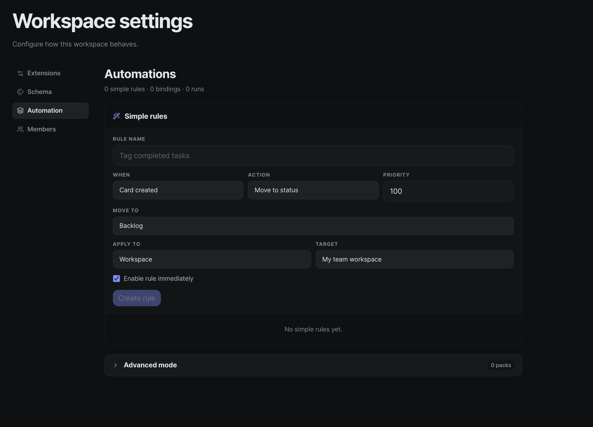
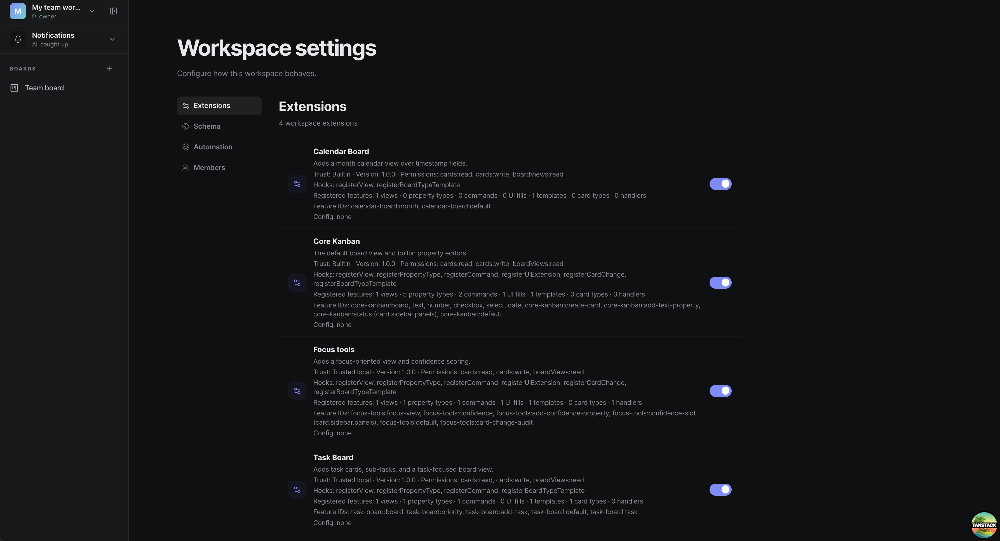

# Plank

Plank is an open-source, team workflow app where the main goal is not excessive features, having a powerful board, but a simple core with a powerful plugin system and a automation engine, built on top of Convex.

So teams can make their own workflow how they like and thats it, no more, no less.


## Why this exists

This started after watching Theo T3 talk about whsy he uses Notion over Obsidian.
As someone who has been using VS Code for a long time and who recently tried the Pi coding agent, I kept
thinking about a team collaboration platform that is extensible at its core.
Plank is my vision of that: a solid base that teams can shape
with plugins to fit how they actually work.

<div style="border-left: 4px solid #2563eb; background: #000000; padding: 12px 14px; margin: 12px 0;">
  <strong>Feedback welcome:</strong> This is my first open-source project, and I would really value your help.
  If I got something right, got something terribly wrong, missed important pieces, or overlooked optimizations and improvements, please tell me.
</div>


**Plank Board Overview** - Main interface showing the layout.
- **kanban** is just a plugin if you dont like it make your own, and thats the point.

---

**Automation Panel** - Interface for creating and managing automation rules.

---

**Plugins** - Interface for managing plugins.

## Alpha status

Plank is currently in **alpha**.

- bugs and breaking changes are expected
- features and data models may change without migration guarantees
- do not use this project for production workloads yet

## Authentication warning

Current auth is intentionally simple for development velocity and is **not security-hardened**.

- minimal checks and guardrails are implemented today
- threat modeling and full security review are still pending
- treat this as a development/demo setup, not production-grade auth


## Current product state

Reviewed against the codebase on 2026-05-21.

Implemented today:

- realtime workspaces with members, invites, auth, presence, and seen state
- boards backed by typed cards, board types, card types, and tags
- board views: Kanban, Calendar, Focus, and Task Board
- workspace-level plugin enable/disable controls
- split client/server plugin packages with shared manifests and generated registries
- plugin-driven property types, commands, UI extension fills, card renderers, board type templates, card type manifests, and card-change hooks
- governed UI extension slots for shell, board header, named card surfaces, and workspace settings
- typed persisted plugin/platform state for board view config, workspace extension config, board settings, board type view defaults, and board view feature instances
- persisted plugin diagnostics and admin-facing extension governance
- automation packs, bindings, compile/activate flow, and run logs
- board search, command palette, and plugin-aware card drawer rendering

Current limits:

- behavior-triggered writes do not re-emit normalized card events yet
- `notify` is trace-only in v1 (no email/push/chat delivery)
- plugins are trusted local code; there is no remote marketplace or sandbox

## Repo layout

- `apps/web` - TanStack Start frontend
- `convex` - schema, auth, queries, mutations, search, and behavior runtime
- `packages/domain` - shared domain types and helpers
- `packages/ui` - UI primitives
- `packages/plugin-sdk` - plugin authoring API
- `packages/plugin-runtime` - builtin registry and enablement filtering
- `packages/board-views` - shared board-view utilities
- `packages/plugins/*` - builtin plugins

## Getting started

### Prerequisites

- Node.js
- pnpm
- a Convex project or local Convex dev environment

### Install and run

```bash
pnpm install
npx convex dev
pnpm dev
```

Useful follow-up commands:

```bash
pnpm convex:codegen
pnpm typecheck
pnpm test
```

### Plugin artifact cleanup

Local plugin experiments can leave Convex rows behind after the plugin package is
removed from `packages/plugins/*` and the builtin registry is regenerated. Use the
owner-only maintenance functions to preview and clean those stale plugin artifacts
without deleting normal workspace content.

Always preview first:

```bash
pnpm exec convex run maintenance:previewPluginArtifactCleanup '{"workspaceSlug":"<workspace-slug>"}' --identity '{"tokenIdentifier":"<owner-token-identifier>","subject":"<owner-subject>"}'
```

Then, if the preview looks safe:

```bash
pnpm exec convex run maintenance:cleanupPluginArtifacts '{"workspaceSlug":"<workspace-slug>"}' --identity '{"tokenIdentifier":"<owner-token-identifier>","subject":"<owner-subject>"}'
```

The cleanup removes only orphan plugin artifacts: stale workspace extension rows,
plugin diagnostics, safe orphan board views, safe orphan card type registry rows,
and workspace-scoped automation experiment rows. It preserves boards, cards, tags,
comments, members, invites, notifications, and any row still referenced by cards.
Blocked rows are reported in the preview and require manual migration or deletion
of the referencing content.

Note: `core.todo` is the normal default card type. Older dev databases may show
its registry row as `pluginId: "core-cards"` even though `core-cards` is not in
the current builtin plugin registry. Do not delete `core.todo` cards just to clear
that blocker; migrate or repair that registry row instead.

### Environment setup

Copy `.env.example` values into your local `.env.local` and set your own Convex deployment values.

### Auth setup

Plank uses Convex Auth with local email/password accounts during development.

```bash
pnpm exec auth --web-server-url http://localhost:3000
```

## Documentation

- [`docs/README.md`](docs/README.md)
- [`docs/architecture.md`](docs/architecture.md)
- [`docs/plugins.md`](docs/plugins.md)
- [`docs/platform-later-marketplace-phases.md`](docs/platform-later-marketplace-phases.md)

## Open-source files

- [`LICENSE`](LICENSE)
- [`CONTRIBUTING.md`](CONTRIBUTING.md)
- [`CODE_OF_CONDUCT.md`](CODE_OF_CONDUCT.md)
- [`SECURITY.md`](SECURITY.md)
- [`SUPPORT.md`](SUPPORT.md)
- [`CHANGELOG.md`](CHANGELOG.md)
